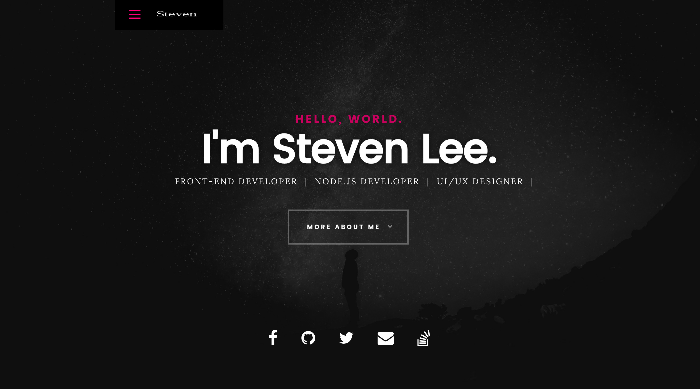

# **momodiy.github.io**

[欢迎来到我的首页](https://momodiy.github.io) 
[备用地址](https://geeksteven.gitee.io/momodiy.github.io/)from gitee

## 目录  
* [背景介绍](#背景介绍)
* [项目介绍](#项目介绍)
* [使用说明](#使用说明)
* [License](#License)

  
## 背景介绍 

*[https://momodiy.github.io](https://momodiy.github.io/)*:这是我的个人网站，可以狠狠的点击查看

## 项目介绍 
一个简单的个人网站，目前只有前台页面。

预计加入的邮件功能被我单独分离了一个项目，点击[这里](https://github.com/momodiy/nodemailer-SMTP-server)查看（使用express+nodemailer+jade构建）。

  
## 使用说明

低调star，无需fork。

  
## License
[MIT](#License)

## Visitors
 
